# Payroll Management System 
----------

##Language Used:
* Java

## Database Used:
* MySQL

## Features
* Admin can Login  
* Employee Regestration
* Basic Payroll all information( Salary, Bonus, Incetives, Deduction).
* Leave Management
* Pay-slip generation
* All type report generation( All employee information report, leave report, Deduction report, Incentives report).

### Screenshot of the System

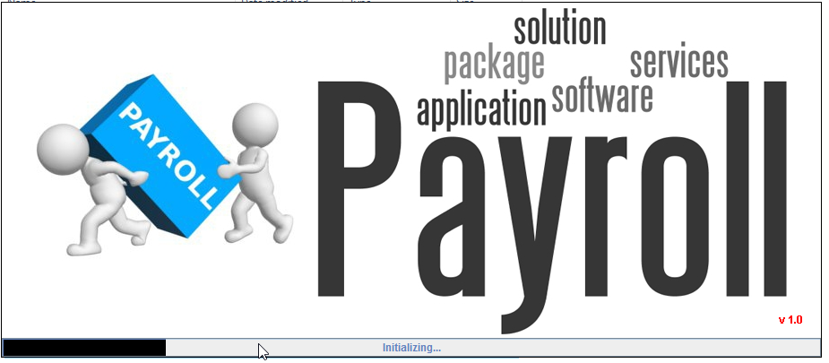

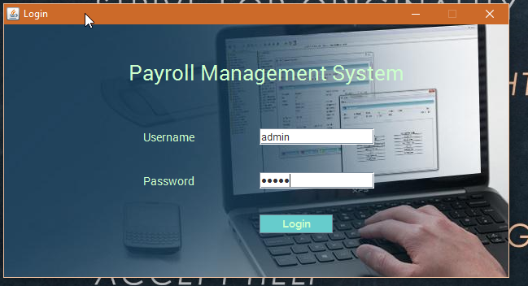

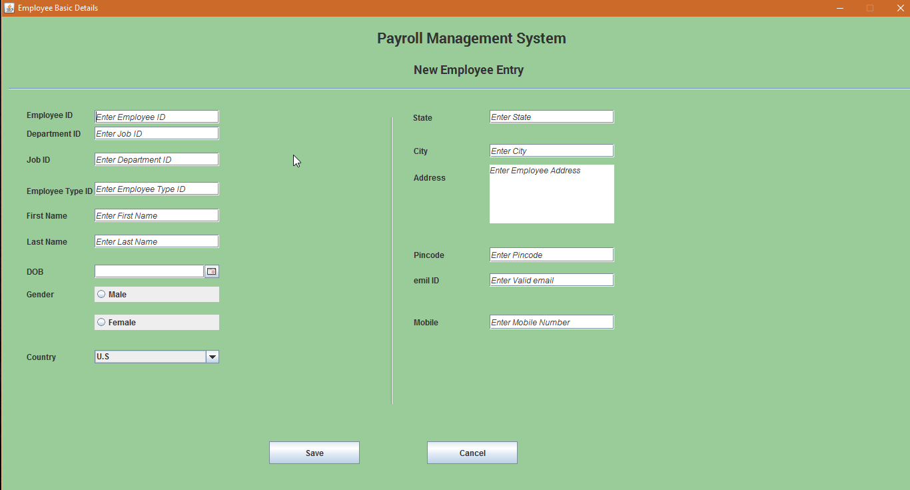

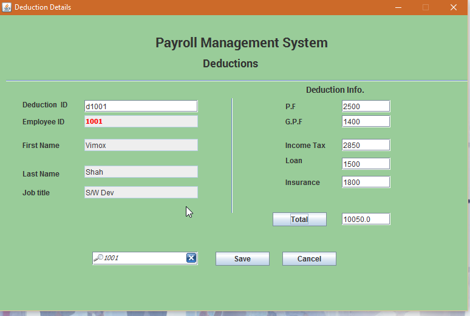

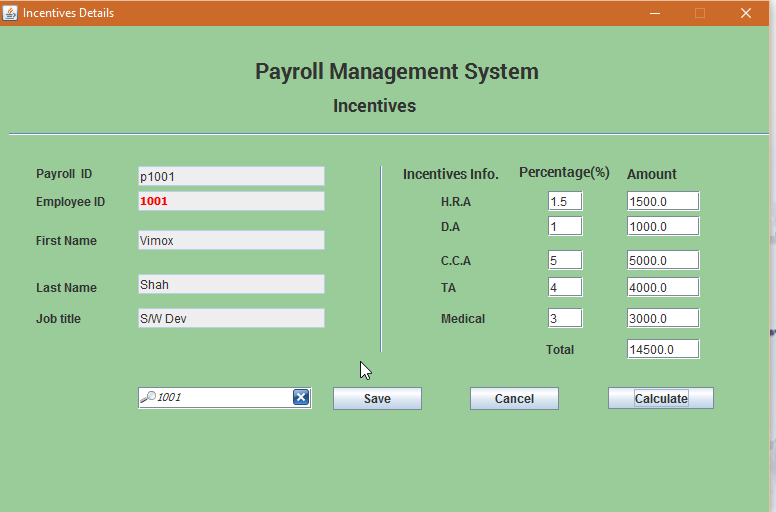

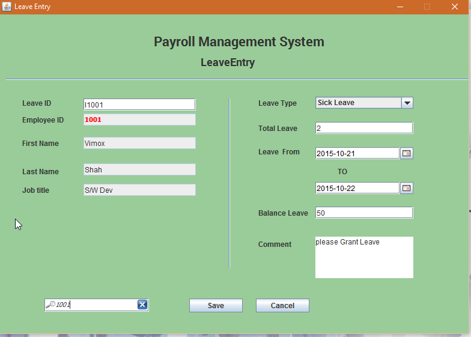

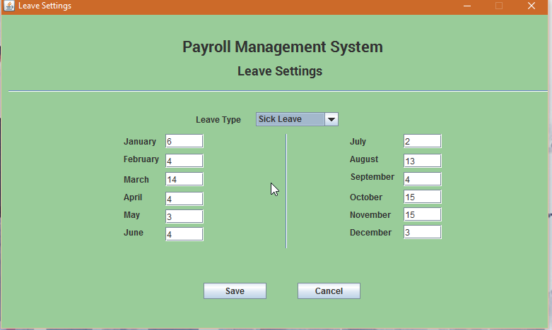

![leave report] (leave_report.png)

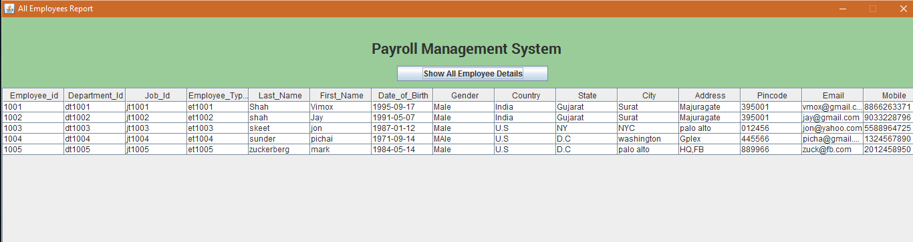

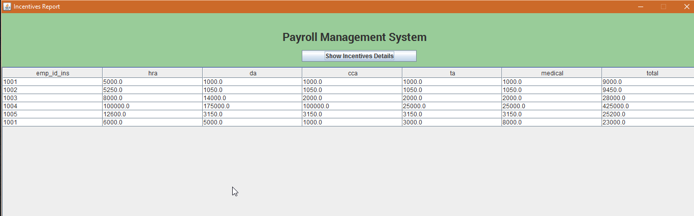

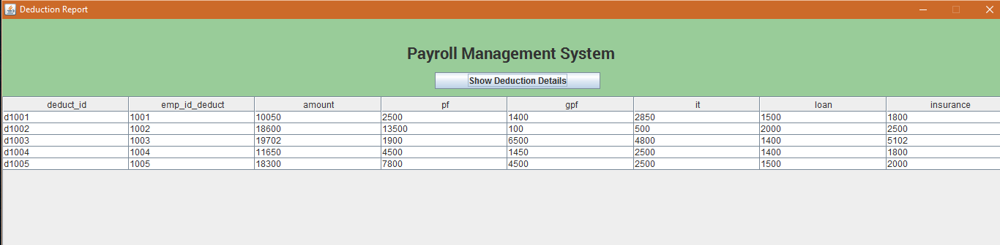

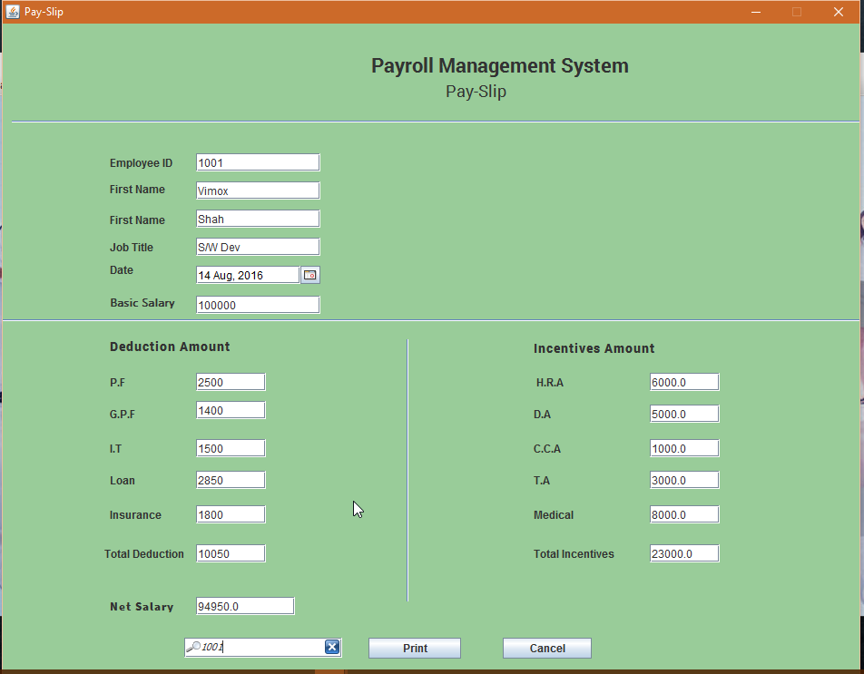

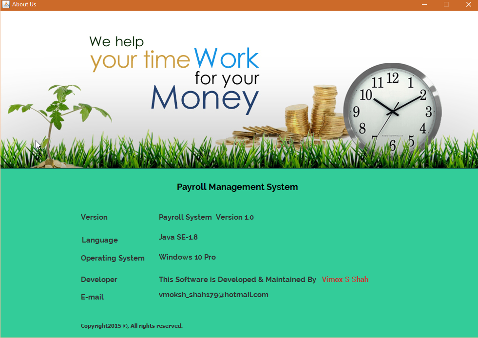

